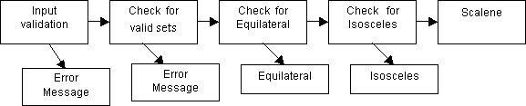

WEINBURG-MYERS TRIANGLE PROGRAM EXAMPLE
To demonstrate the test design procedure there is no better example than the Weinberg-Myers Triangle problem. This example is often used in job interviews as a test of the ability to create test cases. Generally it is administered not because it is a great interview device but because the QA manager has read it in a book (see link above) or had it given in their own interview.

In its original form the problem was set for punch card reading programs. The triangle program reads three numbers from a punch card and interprets them as the sides of a triangle. The program then states whether the triangle is scalene, equilateral, or isosceles. For our example we suppose the program to be written in C# running on the .NET framework and accepting input through a web form. 

Software Test Designers would undertake the following steps:

1) Consult with the subject matter expert in triangles to understand what makes a triangle program valuable to its users. 
2) Consult with technical experts to determine technical risks to consider in framing our tests.
3) Determine the control, data and transaction flows of the program 
4) Make a list of bets as to the types of errors that may have been made in programming.
5) Design the formal sequence of tests
6) Specify input values that prove or disprove the presence of faults for each test case specified in step 5.

From the subject matter expert we would learn that a triangle is: 
* equilateral if all three sides are of equal length,
* isosceles if any two sides are of equal length,
* scalene if no two sides are the same length. 

Also, we would learn:

A set of three values can be validly interpreted as the sides of a triangle only if each element is positive (not zero or less than zero).
If the sum of two numbers in the input set is equal to or less than the third, for any of the three permutations of the input elements, then the set does not describe a triangle.

From the technical expert (and this could include the designers, architects, developers and IT support staff) we would be assured that memory leaks are not an issue and that the data type of the input values is "signed integer" (in this case). Let us stipulate that only single digit positive non zero integers are to be acceptable as inputs. This stipulation reduces the total space of valid inputs to 9*9*9 = 729 different sets of three numbers.

Having gathered this expertise we can make a basic and very rough flow diagram for the program:

Input validation will ensure that any input other than a set of three integers will return some suitable error message. Next, the check for valid sets will verify that the relationships among the three elements of the input set are suitable for forming a triangle. Again, where these sets are not proper a suitable error message will be returned. Finally, given valid triangle sets these can be asses first for being equilateral and then isosceles. In each case the announcement of the type is returned. A valid set that is neither equilateral nor isosceles must be scalene, so that is the end result. Not included in the diagram is the implicit return path for another input set after any error message or triangle type determination is given.

The next stage in designing tests for this program is to establish bets as where errors or faults may occur, either because the code is incorrect, or because some other aspect of the programs operation has malfunctioned. For this case we will assume the only risks are coding errors. 

For input valuation we want to ensure that only sets of three positive non-zero integers are input. Thus we want to test that an error message is produced for any of the following:

* Any element of an input set is negative 
* Any element of an input set is zero
* Any element of an input set is greater than 9
* Any element of an input set is an alphabetic letter
* Any element of an input set is a character symbol
* There are less than three elements of the input set
* There are more than three elements of the input set
* Any element of an input set is a combination of any of the invalid inputs

Next we want to test against the risk of sets of inputs of three numbers 1-9 that cannot form triangles. If any of these is input a suitable error message should result:

* The sum of two numbers equals the third in any of three permutations a+b=c, a+c=b, b+c=a.
* The sum of two numbers is less than the in any of three permutations a+b=c, a+c=b, b+c=a.

Next we want to ensure that given a proper set of inputs for a triangle the correct type is determined by the program:

* If and only if all three digits of a valid input are the same the program displays that it has recognized an "equilateral" triangle
* If and only if any two of the digits of a valid input are the same the program displays that it has recognized an "isosceles" triangle
* If and only if each digit of a valid input is different the program displays that it has recognized a "scalene" triangle.

The preceding list of bets about errors may have been made in the coding really look like a set of requirements. The next step is to turn these bets into test cases. Note that if we do not have access to the code and how it is written we will have to design a wider range and longer list of test cases to capture these bets.
For example, we may know from the code that the program rejects the input set (0,0,0) and provides an error message because the set contains a zero. If we don't know that the code is doing this we would want to verify that the code does not treat (0,0,0) as an equilateral triangle. The less we know about the code the more suspicious our testing cases need to be to reflect the greater uncertainty that the program presents and the larger number of risks we must assume.

The test cases that will determine the outcome of our bets about the program are listed below together with input values chosen to prove or disprove a fault:

* Tests 	Inputs	Expected Results
* Any element of an input set is negative	(-1,1,1), (1,-1,1), (1,1,-1)	Error Message
* Any element of an input set is zero	(0,1,1), (1,0,1), (1,1,0), (1,0,0), (0,1,0), (0,0,1), (0,0,0)	Error Message
* Any element of an input set is greater than 9	(10,1,1), (1,11,1), (1,1,12) (15,15,15)	Error Message
* Any element of an input set is an alphabetic letter	(T,1,1), (1,T,1), (1,5,T)	Error Message
* Any element of an input set is a character symbol	(:,1,3), (5,., 8), (2,4,/)	Error Message
* There are less than three elements of the input set	(1,2)	Error Message
* There are more than three elements of the input set	(2,4,5,8)	Error Message
* Any element of an input set is a combination of any of the invalid inputs	(1A, 3,4), (4,/W",8) (2,4,:)	Error Message
* The sum of two numbers equals the third in any of three permutations a+b=c, a+c=b, b+c=a	(2,4,6), (4,9,5), (8,4,4)	Error Message
* The sum of two numbers is less than the third in any of three permutations a+b	(3,3,8), (2,5,1), (7,3,3)	Error Message
* If all three digits of a valid input are the same the program displays that it has recognized an "equilateral" triangle	(5,5,5)	Equilateral !
* If any two of the digits of a valid input are the same the program displays that it has recognized an "isosceles" triangle	* (3,3,4),(7,8,7),(5,6,6)	Isosceles !
* If each digit of a valid input is different the program displays that it has recognized a "scalene" triangle.	(3,4,5), (3,5,4), (5,4,3)	Scalene !

_Note the "only if" direction of the last three bets is captured by the input validation._

From : https://web.archive.org/web/20160502185829/http://www.testdesigners.com/testingstyles/triangleexample.html
